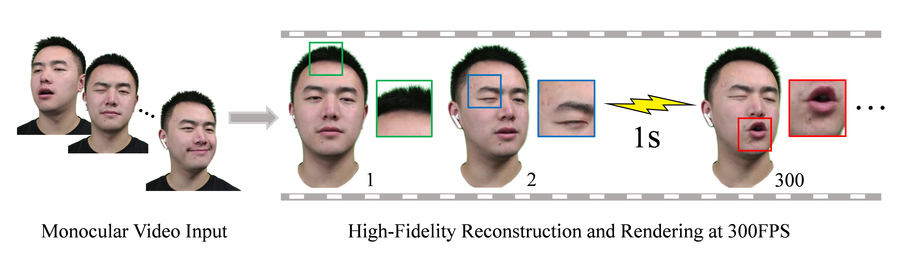

**This README is a minimally adpated version of the original one in the [FlashAvatar repository](https://github.com/USTC3DV/FlashAvatar-code). Please report issues that are not related to HyperGaussians to the original repository.**

# HyperGaussians-FlashAvatar

Given a monocular video sequence, our proposed FlashAvatar can reconstruct a high-fidelity digital avatar in minutes which can be animated and rendered over 300FPS at the resolution of 512×512 with an Nvidia RTX 3090.

## Setup

Get the repository and checkout the `flash_avatar` branch:
```shell
git clone git@github.com:gserifi/HyperGaussians.git
git checkout flash_avatar
git submodule update --init --recursive # simple-knn, diff-gaussian-rasterization, face_parsing
```

This code has been tested on Nvidia RTX 4090 and RTX 2080 Ti. 

Install PyTorch (tested with version 2.5.1+cu121):
```shell
pip install torch==2.5.1 torchvision==0.20.1 --index-url https://download.pytorch.org/whl/cu121
```
Install HyperGaussians-FlashAvatar:

```shell
pip install -e .
```

## FLAME Model

Our code relies on FLAME 2020. Please download the [original assets](https://flame.is.tue.mpg.de/download.php) to the following paths:
- FLAME 2020 (fixed mouth, improved expressions, more data) -> `flame/generic_model.pkl`
- FLAME Vertex Masks -> `flame/FLAME_masks/FLAME_masks.pkl`

## Data Convention
The data is organized in the following format:
```
dataset
├── <id1_name>
    ├── alpha # raw alpha prediction
    ├── imgs # extracted video frames
    ├── parsing # semantic segmentation
├── <id2_name>
...
metrical-tracker
├── output
    ├── <id1_name>
        ├── checkpoint
    ├── <id2_name>
...
```

### Custom Dataset

The following steps outline how to process a custom video:

1. Run [RobustVideoMatting](https://github.com/PeterL1n/RobustVideoMatting)
```shell
python3 preprocessing/rvm.py --video_path <path_to_png_sequence>
```
2. Run [face-parsing.PyTorch](https://github.com/zllrunning/face-parsing.PyTorch) based on [BiSeNet](https://github.com/CoinCheung/BiSeNet)
```shell
python3 preprocessing/semantic.py --input_path <path_to_png_sequence>/../comp
```
3. Convert data format
```shell
python3 preprocessing/organize.py --data_path <path_to_png_sequence>/..
```

Finally, for the FLAME tracking, refer to [metrical-tracker](https://github.com/Zielon/metrical-tracker).

## Usage
- **Train FlashAvatar Baseline**
```shell
python3 train.py --idname <idname> --logname <logname> --project <project>
# For example: python3 train.py --idname nf_01 --logname baseline --project FA
```

- **Train HyperGaussians-FlashAvatar**
```shell
python3 train.py --idname <idname> --logname <logname> --project <project> --ours
# For example: python3 train.py --idname nf_01 --logname ours --project FA --ours
```

- **Render Test Set**
```shell
python3 render.py --idname <idname> --logname <logname> --checkpoint <checkpoint> [--ours] [--rotate]
# For example: python3 render.py --idname nf_01  --checkpoint logs/nf_01_ours/ckpt/ckpt30000.pth --ours
```

This will render the test set and save the images in `logs/<idname>_<logname>/frames`.

- **Compute Metrics**
```shell
python3 metrics.py -m <model_path>
# For example: python3 metrics.py -m logs/nf_01_ours
```

This will save the metrics under `<model_path>/results.json` and `<model_path>/per_view.json`.

- **Cross-Reenactment**
```shell
python3 render.py --idname <dest> --logname <logname> --checkpoint <dest_checkpoint> --cross <source> [--ours]
```

## Citation
If you find this code useful for your research, please cite both FlashAvatar and HyperGaussians:
```
@inproceedings{xiang2024flashavatar,
      author    = {Jun Xiang and Xuan Gao and Yudong Guo and Juyong Zhang},
      title     = {FlashAvatar: High-fidelity Head Avatar with Efficient Gaussian Embedding},
      booktitle = {The IEEE Conference on Computer Vision and Pattern Recognition (CVPR)},
      year      = {2024},
  }
```

```
@todo
```